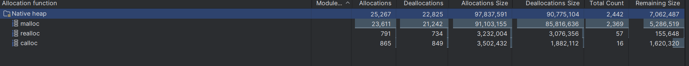

# Huntrix Delta

Offline-first disaster logistics prototype for the HackFusion 2026 `Digital Delta` challenge.

## Resource Disclosure

Per the HackFusion rules, this project uses open-source frameworks, libraries, and AI-assisted pair-programming support during development.

### Open-Source Stack
- Expo / React Native / Expo Router
- React + Vite + Leaflet / React Leaflet
- Go standard library plus gRPC / Protobuf tooling
- `rn-wifi-p2p`
- `react-native-ble-plx`
- `@noble/curves`, `@noble/hashes`
- `@stablelib/aes`, `@stablelib/gcm`
- Buf / `protoc` code generation tooling

### AI Assistance Disclosure
- AI pair-programming assistance was used during development and refactoring, including OpenAI Codex / ChatGPT-style assistance.
- All generated code and architectural decisions were reviewed and adapted inside this repository.

## Current Status
- Expo app shell is in place for command, deliveries, and network views.
- Go scenario loader and routing preview are working.
- Protobuf contracts exist for sync, routing, and delivery flows.
- Chaos simulator is integrated under `services/chaos/`.
- The restored problem statement makes `M1` and `M2` stricter than our earlier shorthand summary, especially real device-to-device sync for `M2.4`.

## Compliance Snapshot
- `C2` Linux CI vegeta run `24307971168`: `100000` requests at `10000.05 req/s`, `9999.84 req/s` throughput, `100%` success, mean latency `190.01 µs`
- `C3` memory snapshot: Java heap `46.36 MB`, native remaining size `7,062,487 bytes` (`~6.74 MB`) during Android profiling
- Workflow: `.github/workflows/c2-vegeta-loadtest.yml`
- APK workflows:
  - `.github/workflows/android-apk-build.yml`
  - `.github/workflows/generate-react-native-cicd.yml`
  - Android workflow also publishes the built APK to GitHub Releases

### C3 Evidence
Android profiling capture:



## Todo/Task
- [x] Bootstrap Expo, Go, and protobuf project structure
- [x] Add first-pass architecture notes and diagrams
- [x] Add shared Sylhet scenario data
- [x] Add Go scenario loader and constrained routing preview
- [x] Integrate Python chaos simulator into repo structure
- [x] Bridge chaos API output into the Go routing preview
- [x] Expose routing through a lightweight Go HTTP API
- [x] Replace the command and network views with live backend fetches
- [x] Generate Go and TypeScript code from `.proto` files
- [x] Generate Go gRPC service stubs and add a first gRPC server
- [x] Add a real gRPC `ComputeRoute` smoke path and client
- [x] Implement offline TOTP/HOTP auth flow with expiry/regeneration demo
- [x] Implement per-device key provisioning
- [x] Add tamper-evident auth logs with corruption detection demo
- [x] Enforce the exact RBAC roles from the restored statement
- [x] Add inventory CRDT and vector-clock merge foundation in Go
- [x] Implement CRDT inventory entries with vector clocks and conflict UI
- [x] Scaffold Expo dev-client and native BLE discovery for transport readiness
- [x] Add a Leaflet route dashboard for M4.4 with offline OSM tile caching
- [x] Upgrade the Go route engine with weighted multi-modal edges and recomputation endpoints
- [x] Add multimodal handoff mission planning and the first in-app route graph
- [x] Add offline proof-of-delivery QR signing, countersigning, replay protection, and receipt-chain sync
- [x] Add autonomous triage prediction and preemption across the route dashboard and app
- [x] Add predictive route decay with trained ML artifacts, penalized rerouting, and risk overlays
- [x] Add hybrid fleet orchestration with drone-required zones, rendezvous logic, handoff simulation, and mesh throttling
- [ ] Replace simulated sync with actual Bluetooth or Wi-Fi Direct delta sync
- [ ] Replace the remaining mobile mock data with scenario-backed live data
- [x] Add `DEMO.md` and model-card source docs
- [ ] Add remaining submission assets

## Scope Correction
The restored Module 1 and Module 2 page changes the plan in one important way:
- simulated sync is no longer enough for full credit on `M2.4`
- auth is no longer generic offline login; it needs offline `TOTP/HOTP`, per-device keys, exact RBAC roles, and tamper-evident auth logs

The repo architecture still stands, but the implementation priority changes:
1. real on-device sync transport moves up
2. auth and audit logging move up
3. “simulated later” assumptions for `M2` are no longer valid if we want full marks

## Repo Layout
```text
apps/mobile        Expo client
services/core      Go routing and system logic
services/chaos     Python chaos simulator
proto              Shared protobuf contracts
data               Scenario fixtures
docs               Architecture and supporting docs
ml                 Training and model artifacts
```

## Commands

### Mobile
```bash
cd apps/mobile
bun install
bun run start
bun run web
bunx tsc --noEmit
eas build -p android --profile development
eas build -p ios --profile development
```

If the app is running on a physical phone, set the backend host explicitly:
```bash
cd apps/mobile
$env:EXPO_PUBLIC_API_BASE_URL="http://YOUR_COMPUTER_LAN_IP:8080"
bun run start
```

For native BLE testing in a dev build:
```bash
cd apps/mobile
$env:EXPO_PUBLIC_API_BASE_URL="http://YOUR_COMPUTER_LAN_IP:8080"
npx expo start --dev-client
```

### Route Dashboard
```bash
cd apps/dashboard
bun install
bun run dev
bun run build
```

If the dashboard is not on the same machine as the Go API, set the backend host explicitly:
```bash
cd apps/dashboard
$env:VITE_API_BASE_URL="http://YOUR_COMPUTER_LAN_IP:8080"
bun run dev
```

### Go Core
```bash
go test ./services/core/...
go run ./services/core/cmd/scenario
go run ./services/core/cmd/scenario -chaos-url http://127.0.0.1:5000
go run ./services/core/cmd/api
go run ./services/core/cmd/api -chaos-url http://127.0.0.1:5000
go run ./services/core/cmd/grpcapi
go run ./services/core/cmd/grpcapi -chaos-url http://127.0.0.1:5000
go run ./services/core/cmd/grpcclient
go run ./services/core/cmd/grpcclient -vehicle speedboat
```

To run the HTTP and gRPC APIs with TLS 1.3:
```bash
go run ./scripts/devcert -hosts "localhost,127.0.0.1,192.168.68.110"
go run ./services/core/cmd/api -tls-cert devcerts/cert.pem -tls-key devcerts/key.pem
go run ./services/core/cmd/grpcapi -tls-cert devcerts/cert.pem -tls-key devcerts/key.pem
```

### M4 Route Endpoints
```bash
curl "http://127.0.0.1:8080/api/route/preview?from=N1&to=N3&vehicle=truck&payload_kg=100"
curl "http://127.0.0.1:8080/api/routes/active"
curl "http://127.0.0.1:8080/api/routes/active?failed_edge=E2&failure_status=washed_out"
curl "http://127.0.0.1:8080/api/routes/missions"
curl "http://127.0.0.1:8080/api/triage/status"
curl "http://127.0.0.1:8080/api/predictive/status"
curl "http://127.0.0.1:8080/api/fleet/orchestration/status"
```

### ML Training
```bash
python ml/training/generate_route_decay_dataset.py
python ml/training/train_route_decay_model.py
```

### M2 Demo Endpoints
```bash
curl http://127.0.0.1:8080/api/sync/inventory/state
curl -X POST "http://127.0.0.1:8080/api/sync/inventory/apply?scenario=causal"
curl -X POST "http://127.0.0.1:8080/api/sync/inventory/apply?scenario=conflict"
curl -X POST "http://127.0.0.1:8080/api/sync/inventory/resolve?choice=local"
curl -X POST "http://127.0.0.1:8080/api/sync/inventory/resolve?choice=remote"
curl -X POST http://127.0.0.1:8080/api/sync/inventory/reset
```

Judge proof docs:
- `DEMO.md`
- `docs/qa/M2-QA.md`
- `docs/compliance/M2-transport-proof.md`
- `docs/submission-checklist.md`
- `docs/pitch-deck-outline.md`
- `docs/architecture-diagram.md`

### Chaos Simulator
```bash
python -m pip install -r services/chaos/requirements.txt
python services/chaos/chaos_server.py
```

### Protobuf Codegen
```bash
powershell -ExecutionPolicy Bypass -File scripts/install-protoc.ps1
powershell -ExecutionPolicy Bypass -File scripts/generate-proto.ps1
```

Direct mobile sync packets now use protobuf `SyncService` RPC frames over the Wi-Fi Direct native socket transport. JSON is retained only for local storage and the developer-facing dashboard APIs.

This closes the schema-drift problem and aligns the payloads with the checked-in service contract, but it is still not the same as running a full HTTP/2 gRPC stack directly on both phones.

If Go dependency fetch is blocked on your network, the generator still emits the `.pb.go` and `.ts` files, but `go mod tidy` may need to be retried later.

## GitHub Actions

### C2 Vegeta
- Manually run `C2 Vegeta Load Test`
- Download the `c2-vegeta-loadtest` artifact for the CI proof report

### Android APK
- Manually run `Android APK Build`
- Download the `android-release-apk` artifact
- Or download the APK from the GitHub Release created by the workflow

### Marketplace Generator
- Manually run `Generate React Native CI/CD Workflow`
- It uses `TanayK07/react-native-expo-cicd-action@v1.0.3`
- The generated workflow is uploaded as an artifact so you can inspect or commit it later

