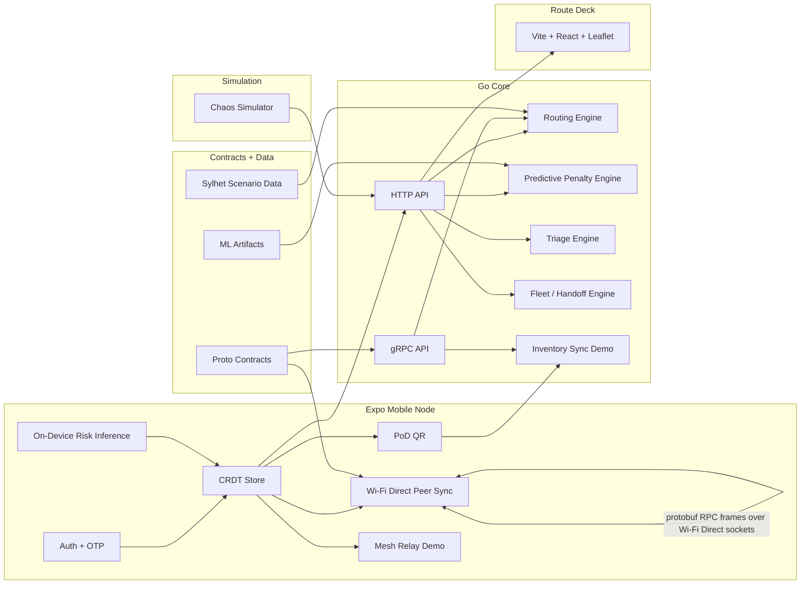

# Architecture Diagram

This file is the export-ready source for `D3`.

Recommended export options:
- render this Mermaid diagram to `PNG`
- export to `PDF`
- recreate it in draw.io using the same component groups and labels

## Diagram

## Protocol Labels

Use these exact labels in the exported visual:
- mobile to peer mobile: `Wi-Fi Direct native socket transport carrying protobuf SyncService RPC frames`
- mobile to Go API: `HTTP + JSON`
- dashboard to Go API: `HTTP + JSON`
- Go internal contract boundary: `gRPC + Protobuf`
- shared schema boundary: `proto/`

## Offline Vs Online Notes

### Offline Path
- auth stays local
- CRDT inventory stays local-first
- PoD stays local
- peer sync uses local radios
- routing and ML overlays continue from preloaded local/system state

### Online / Setup Path
- dashboard loads from Go API
- chaos simulator feeds route failures
- mobile can fetch initial scenario-backed read models before the offline phase

## CAP Theorem Callout

Add this caption under the diagram if you export it:

`CAP choice: AP (Availability + Partition Tolerance). In disaster conditions, nodes must continue operating while partitioned and reconcile later via CRDT merge rules.`
