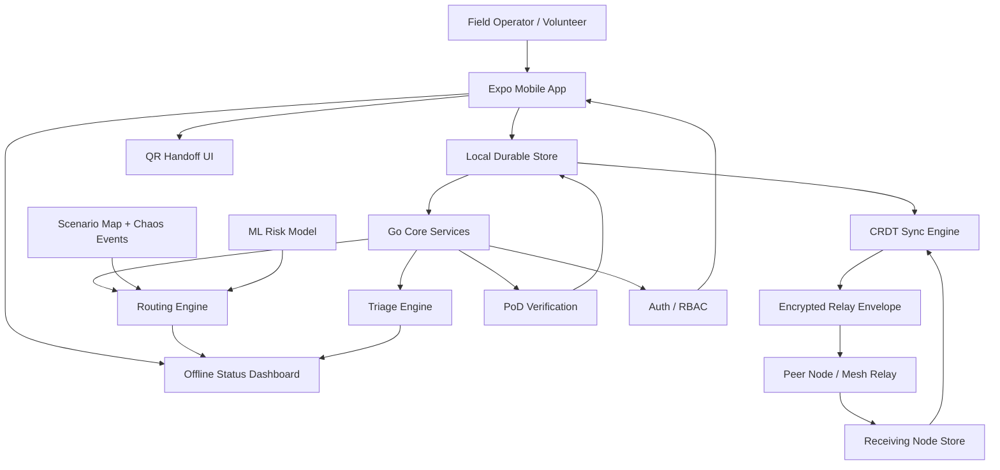
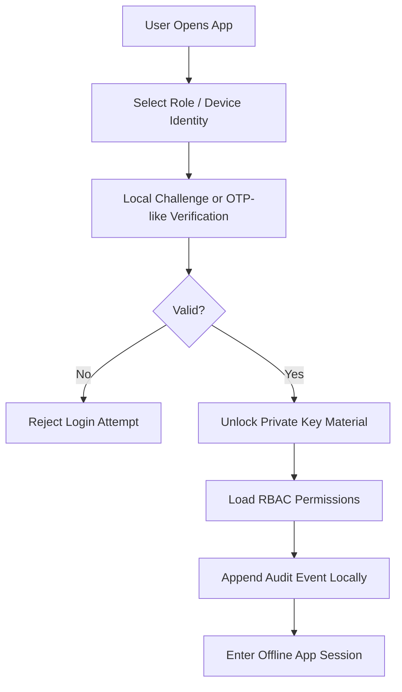
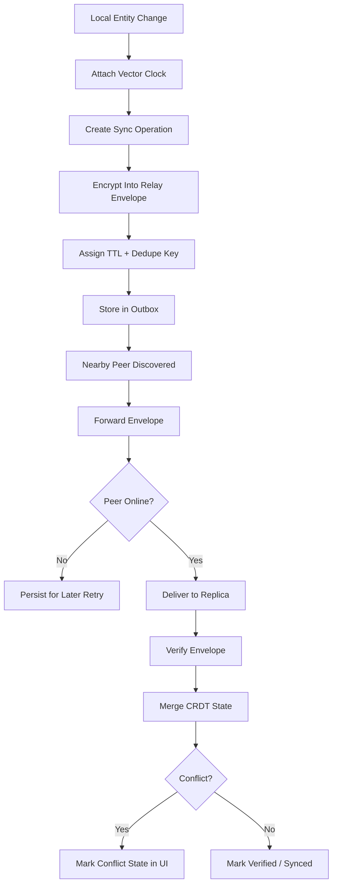
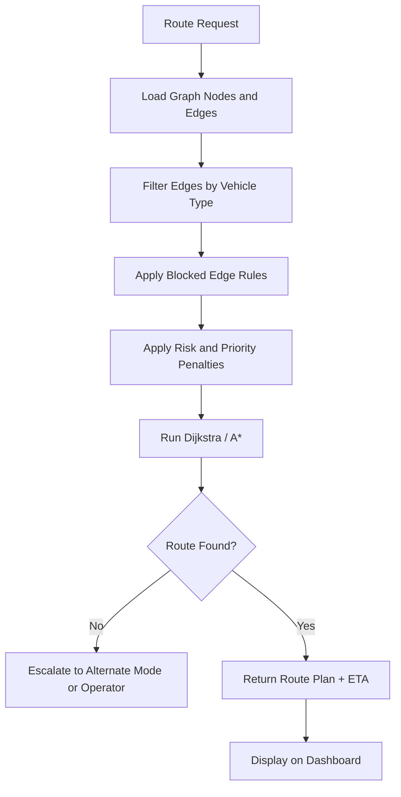
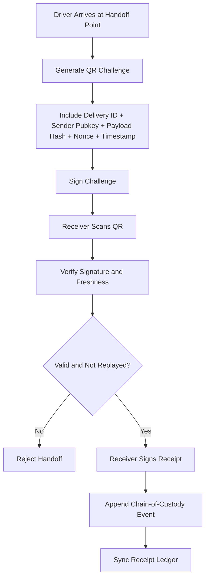
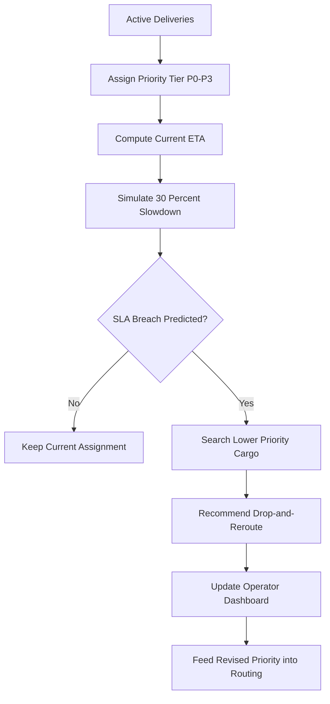
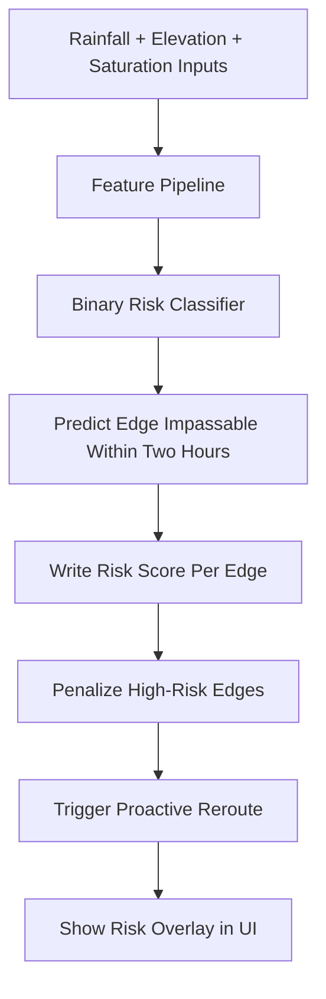
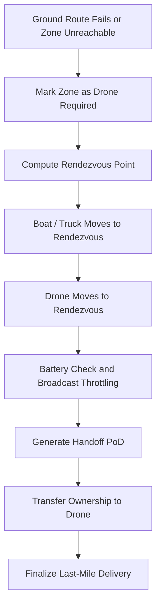
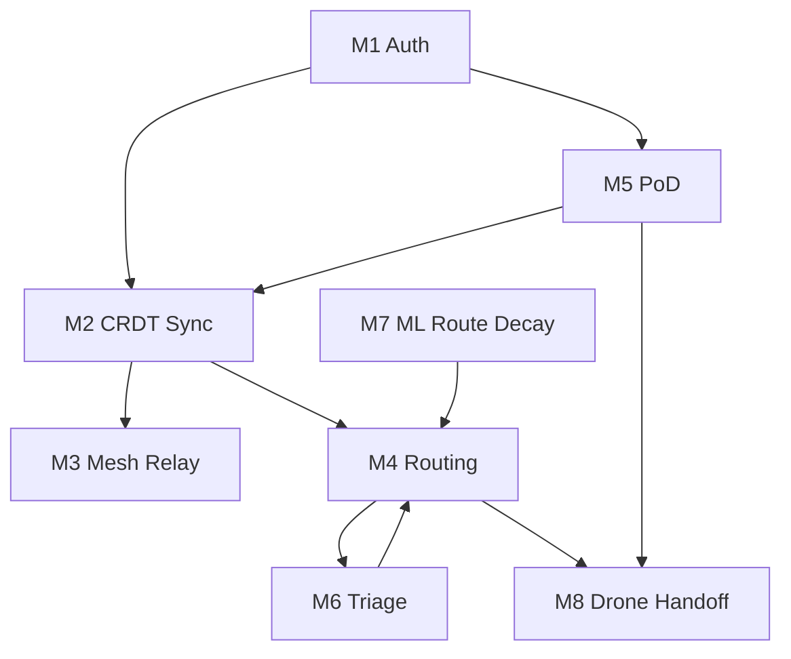

# Architecture

## Goal
Build a resilient logistics prototype that still functions when connectivity is unreliable or absent for most of the operation window.

The system is designed to maximize hackathon scoring under the stated constraints, not to imitate a full production disaster platform.

Working project name: `Huntrix Delta`

## Architecture Summary
`Huntrix Delta` is our implementation of the `Digital Delta` challenge using a contract-first, offline-first architecture with four major layers:

1. `apps/mobile`
   Expo client for operators, volunteers, and field workflows.
2. `services/core`
   Go services for routing, sync, proof-of-delivery, triage, and simulation support.
3. `proto`
   Shared protobuf contracts for node-to-node and app-to-service communication.
4. `ml`
   Python training pipeline and exported risk artifacts used by the routing engine.

## System Flowchart

## CAP Trade-Off
We choose **Availability + Partition Tolerance** over strict immediate consistency.

Why:
- disaster conditions imply frequent partitions
- waiting for central confirmation breaks the mission
- replicated state and delivery events can converge later via CRDT-style merge rules

This choice directly supports:
- offline operations
- delayed sync
- store-and-forward relay behavior

## System Components

### 1. Mobile Node App
Responsibilities:
- local identity and role state
- local queue of deliveries, receipts, and sync ops
- QR handoff flows
- operator dashboard and field task execution
- offline indicators for sync, conflict, and verification state

Storage direction:
- local durable store for entities and operation log
- vector-clock metadata per syncable record

### 2. Mesh and Sync Layer
Responsibilities:
- relay encrypted payload envelopes
- preserve pending messages while peers are offline
- deduplicate by envelope id and payload hash
- merge entity updates using vector clocks and CRDT merge rules

Demo reality:
- first pass may simulate peer relay semantics over local networking before attempting true Bluetooth transport
- transport semantics still follow the rubric: relay, resume, TTL, dedupe, and unreadable ciphertext at relay nodes

### 3. Routing Engine
Responsibilities:
- represent disaster routes as a weighted directed graph
- support `road`, `waterway`, and `airway` traversal modes
- recompute routes quickly when edges fail
- apply penalties from ML risk predictions and triage urgency

Routing direction:
- default algorithm: Dijkstra first, upgrade to A* only if needed
- live edge updates from chaos simulation and predictive risk signals

### 4. Proof-of-Delivery Layer
Responsibilities:
- generate signed handoff payloads
- verify signatures and receipt chain
- reject replay attempts and tampered payloads
- reconstruct chain of custody from ledger events

Crypto direction:
- `Ed25519` for signatures
- `AES-256-GCM` for encrypted envelopes
- `SHA-256` for payload hashes

### 5. Triage and Priority Engine
Responsibilities:
- classify cargo as `P0` through `P3`
- predict SLA breach risk under slowdown assumptions
- preempt low-priority deliveries when critical cargo is endangered

### 6. Predictive Route Decay
Responsibilities:
- score route edges for near-term impassability
- ingest rainfall, elevation, and soil saturation proxy features
- feed risk scores into rerouting decisions

## Module Coverage Plan
| Module | Plan |
|------|------|
| `M1` Auth | Minimal offline identity, OTP-like local challenge flow, RBAC for demo roles |
| `M2` CRDT Sync | High priority, core differentiator |
| `M3` Mesh | High priority, initially simulated if needed |
| `M4` Routing | High priority, central demo surface |
| `M5` PoD | High priority, cryptographic demo moment |
| `M6` Triage | High priority, directly visible in dashboard |
| `M7` ML Route Decay | High priority, keep model simple and useful |
| `M8` Drone Handoff | Stretch after core loop works |

## Data Flow
1. Operator creates or updates a delivery.
2. Delivery is written locally with vector-clock metadata.
3. Mesh layer packages the update into an encrypted relay envelope.
4. Peer nodes store, forward, and eventually deliver the envelope.
5. Sync engine merges the received entity state.
6. Routing engine recalculates based on map state, risk signals, and cargo priority.
7. Driver or volunteer executes handoff via signed QR challenge.
8. Receipt event becomes part of the replicated ledger.

## End-to-End Operational Flow

```mermaid
flowchart LR
    A[Create Delivery] --> B[Write Local Entity + Vector Clock]
    B --> C[Package Sync Operation]
    C --> D[Encrypt Payload]
    D --> E[Relay Through Mesh Peers]
    E --> F[Merge at Target Replica]
    F --> G[Recompute Route]
    G --> H[Apply Triage + Risk Penalties]
    H --> I[Dispatch Vehicle]
    I --> J[Generate Signed QR Challenge]
    J --> K[Receiver Verifies + Signs Receipt]
    K --> L[Append Receipt to Ledger]
    L --> M[Sync Converges Across Nodes]
```

## Module Flowcharts

### M1 - Authentication and Identity

### M2 and M3 - CRDT Sync and Mesh Relay

### M4 - Multi-Modal Routing Engine

### M5 - Proof-of-Delivery Flow

### M6 - Triage and Priority Preemption

### M7 - Predictive Route Decay

### M8 - Drone Handoff Orchestration

## Module Dependency View

## Initial Repo Decision
Use a single Expo codebase for the main client.

Reason:
- team preference
- fast iteration
- shared UI and state across mobile and web

Map decision for first pass:
- use Expo web for the richer route dashboard if Leaflet integration is faster there
- keep native mobile focused on field workflows and status views
- avoid a second frontend app unless Expo web becomes a blocker

## Immediate Implementation Order
1. lock scenario data
2. define protobuf contracts
3. implement Go graph and sync domain models
4. scaffold Expo app around the judged flows
5. add risk model and PoD crypto flows
6. harden the demo path

## Demo Story
The strongest live demo sequence is:
1. start offline with seeded nodes and deliveries
2. simulate a route failure
3. show reroute and priority preemption
4. relay updates across disconnected peers
5. complete a signed handoff
6. show the receipt chain and sync state converge
