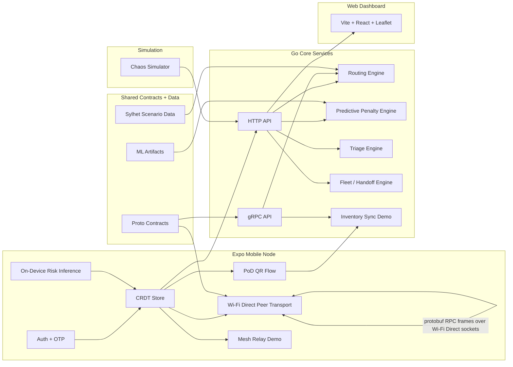
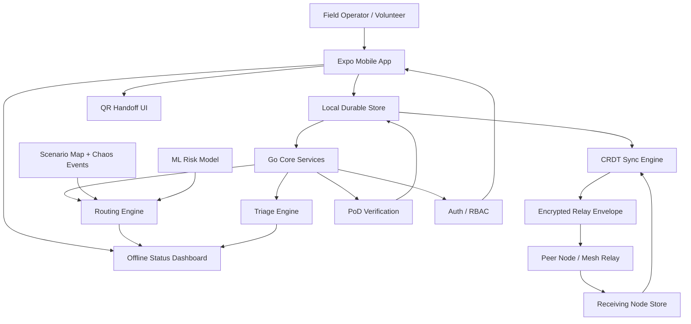
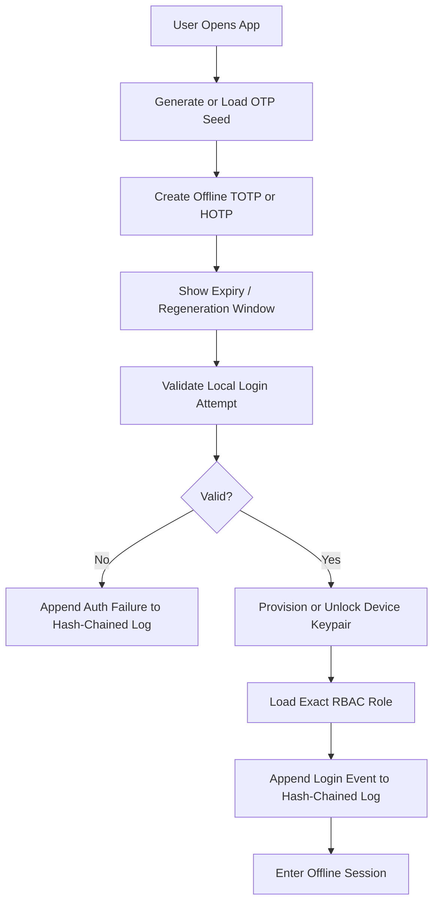
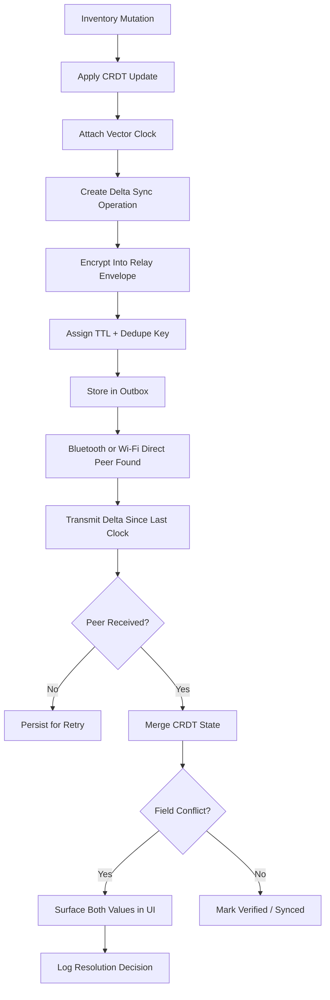
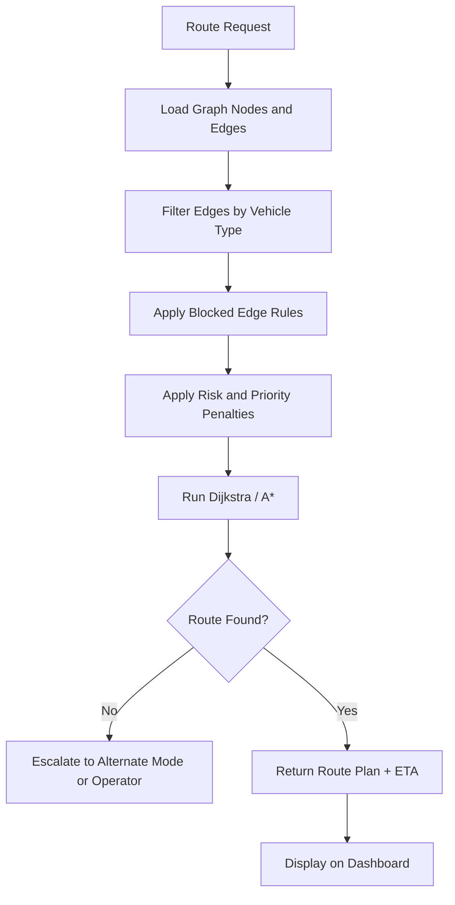
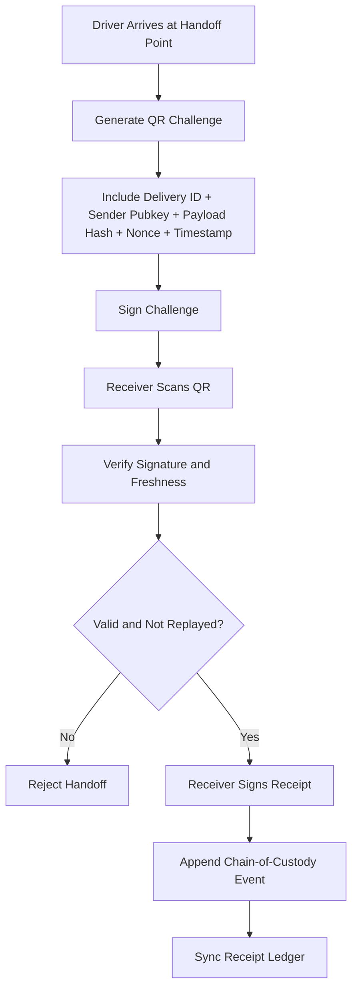
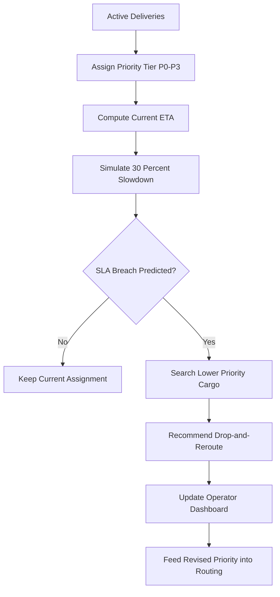
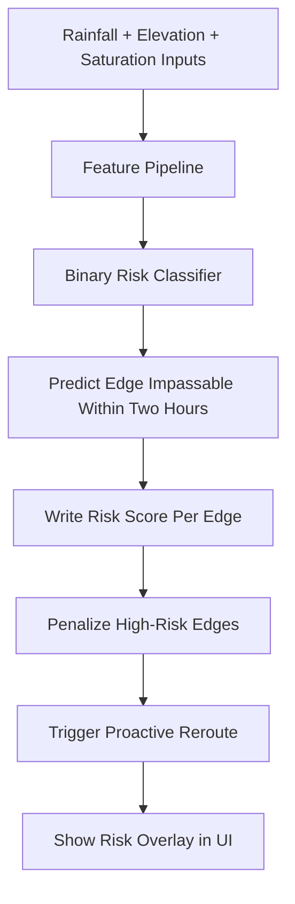
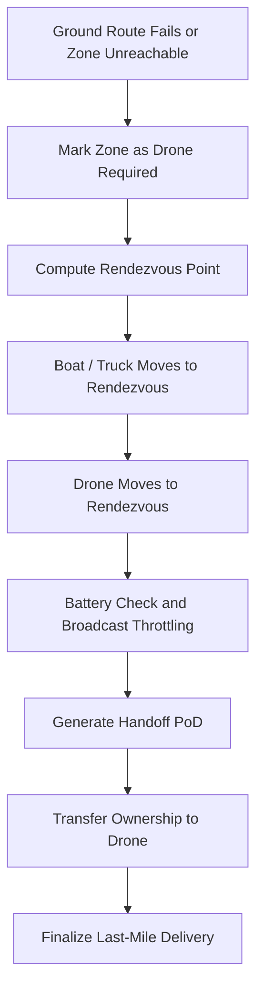
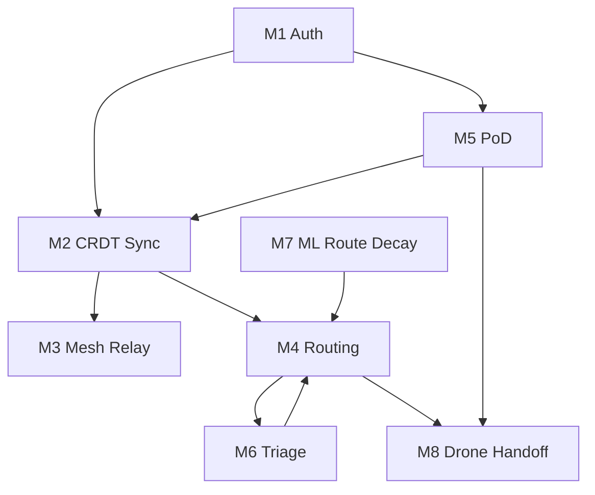

# Architecture

## Goal
Build a resilient logistics prototype that still functions when connectivity is unreliable or absent for most of the operation window.

The system is designed to maximize hackathon scoring under the stated constraints, not to imitate a full production disaster platform.

Working project name: `Huntrix Delta`

## Architecture Summary
`Huntrix Delta` is our implementation of the `Digital Delta` challenge using a contract-first, offline-first architecture with four major layers:

1. `apps/mobile`
   Expo client for operators, volunteers, and field workflows.
2. `services/core`
   Go services for routing, sync, proof-of-delivery, triage, and simulation support.
3. `proto`
   Shared protobuf contracts for node-to-node and app-to-service communication.
4. `ml`
   Python training pipeline and exported risk artifacts used by the routing engine.

## Formal Architecture Diagram

This section is the formal judge-facing architecture summary for `D3`.

## Component And Protocol Matrix

| Surface | Responsibility | Primary Protocol / Format |
|------|------|------|
| `apps/mobile` | offline auth, CRDT state, PoD, peer sync, field UX | local storage, protobuf payloads, QR payloads |
| `apps/dashboard` | route deck, risk overlays, mission visibility | HTTP + JSON from Go API |
| `services/core/cmd/api` | dashboard and mobile read model endpoints | HTTP + JSON |
| `services/core/cmd/grpcapi` | contract-first service surface | gRPC + Protobuf |
| `services/chaos` | route failure injection | HTTP + JSON |
| `proto/` | shared schema boundary | Protobuf |
| `ml/training` | dataset generation and training | CSV + Python scripts |
| `ml/artifacts` | trained coefficients and metrics | JSON artifacts |

## Offline Vs Online Data Flow

### Offline Mode

1. Mobile app loads local auth state, OTP secrets, key material, receipts, and CRDT inventory.
2. Inventory and PoD actions are committed locally first.
3. Peer devices exchange protobuf sync frames over Wi-Fi Direct when available.
4. Routing, triage, and predictive panels continue to function from previously loaded scenario and artifact data.
5. Mesh relay demo continues to show store-and-forward semantics without internet.

### Online / Setup Mode

1. Laptop or local host starts Go API, gRPC API, and chaos simulator.
2. Dashboard loads route, predictive, triage, and orchestration views from the Go API.
3. Mobile app can fetch current scenario-backed read models from the Go API.
4. Judges can then disable internet for the critical demo phase while keeping local peer transport active.

## CAP Theorem Choice

We choose **AP**: `Availability + Partition Tolerance`.

Justification:
- the disaster scenario assumes frequent partitions and intermittent peer visibility
- field operators must continue writing local state while disconnected
- convergence is handled after the fact using vector clocks and CRDT merge rules
- this is more consistent with the product requirement than blocking on a central consistency authority

## Scope Correction
The restored problem-statement page materially tightens `Module 1` and `Module 2`.

What this means:
- `M1` is not just generic offline auth. It specifically requires offline `TOTP/HOTP`, per-device asymmetric key provisioning, exact named RBAC roles, and tamper-evident auth logs using hash chaining.
- `M2` is not just eventual convergence in principle. It explicitly requires CRDT-backed inventory data, vector clocks on every mutation, UI conflict resolution, and actual Bluetooth or Wi-Fi Direct delta sync for full credit on `M2.4`.

Architecture impact:
- the overall architecture does **not** need a full rewrite
- the priority order **does** change
- simulated sync is acceptable only as an intermediate development step, not as the final answer for `M2.4`

## System Flowchart

## System Components

### 1. Mobile Node App
Responsibilities:
- local identity and role state
- offline OTP generation and expiry handling
- device keypair creation and secure local key storage
- hash-chained auth audit logs
- local queue of deliveries, receipts, and sync ops
- QR handoff flows
- operator dashboard and field task execution
- offline indicators for sync, conflict, and verification state

Storage direction:
- local durable store for entities and operation log
- vector-clock metadata per syncable record
- secure storage for private keys and OTP seed material

### 2. Mesh and Sync Layer
Responsibilities:
- relay encrypted payload envelopes
- preserve pending messages while peers are offline
- deduplicate by envelope id and payload hash
- merge entity updates using vector clocks and CRDT merge rules
- eventually perform actual Bluetooth or Wi-Fi Direct delta sync between devices

Demo reality:
- early development may simulate peer relay semantics over local networking
- final judged path for `M2.4` should use actual device-to-device sync, not only a simulation
- transport semantics must still satisfy relay, resume, TTL, dedupe, and unreadable ciphertext at relay nodes
- the current peer path uses protobuf `SyncService` request/response frames over native Wi-Fi Direct socket messaging
- this improves contract fidelity and two-device proof quality
- it is still not identical to a full on-device HTTP/2 gRPC runtime on both phones, so claims should stay precise

### 3. Routing Engine
Responsibilities:
- represent disaster routes as a weighted directed graph
- support `road`, `waterway`, and `airway` traversal modes
- recompute routes quickly when edges fail
- apply penalties from ML risk predictions and triage urgency

Routing direction:
- default algorithm: Dijkstra first, upgrade to A* only if needed
- live edge updates from chaos simulation and predictive risk signals

### 4. Proof-of-Delivery Layer
Responsibilities:
- generate signed handoff payloads
- verify signatures and receipt chain
- reject replay attempts and tampered payloads
- reconstruct chain of custody from ledger events

Crypto direction:
- `Ed25519` for signatures
- `AES-256-GCM` for encrypted envelopes
- `SHA-256` for payload hashes

### 5. Triage and Priority Engine
Responsibilities:
- classify cargo as `P0` through `P3`
- predict SLA breach risk under slowdown assumptions
- preempt low-priority deliveries when critical cargo is endangered

### 6. Predictive Route Decay
Responsibilities:
- score route edges for near-term impassability
- ingest rainfall, elevation, and soil saturation proxy features
- feed risk scores into rerouting decisions

## Module Coverage Plan
| Module | Plan |
|------|------|
| `M1` Auth | High priority: offline TOTP/HOTP, device keys, named RBAC roles, tamper-evident auth logs |
| `M2` CRDT Sync | High priority: CRDT inventory model, vector clocks, conflict UI, actual device sync target |
| `M3` Mesh | High priority, initially simulated if needed |
| `M4` Routing | High priority, central demo surface |
| `M5` PoD | High priority, cryptographic demo moment |
| `M6` Triage | High priority, directly visible in dashboard |
| `M7` ML Route Decay | High priority, keep model simple and useful |
| `M8` Drone Handoff | Stretch after core loop works |

## Data Flow
1. Operator creates or updates a delivery.
2. Delivery is written locally with vector-clock metadata.
3. Mesh layer packages the update into an encrypted relay envelope.
4. Peer nodes store, forward, and eventually deliver the envelope.
5. Sync engine merges the received entity state.
6. Routing engine recalculates based on map state, risk signals, and cargo priority.
7. Driver or volunteer executes handoff via signed QR challenge.
8. Receipt event becomes part of the replicated ledger.

## Current Submission Status

### Strongest Deliverables
- repository structure is on the right track for `D1`
- `README.md`, `.proto` files, and root `DEMO.md` are present
- `docs/architecture.md` now includes component, protocol, data-flow, and CAP-theorem coverage for `D3`
- `docs/model-card.md` covers the required content for `D4`, but still needs exporting to a final one-page PDF if the portal expects PDF specifically

### Remaining Deliverable Gaps
- a formal exported architecture image or draw.io/Lucidchart asset is still advisable in `docs/` for `D3`
- the pitch deck for `D5` is still missing
- the optional `D6` walkthrough video is not present

## Rule And Risk Notes

### On Track
- no cloud-hosted primary backend
- protobuf contracts are checked into version control
- Go is used for the core backend layer
- offline-first behavior is clearly reflected in the architecture

### Needs Honest Framing
- `M2.4` is stronger now, but still not a full native HTTP/2 gRPC runtime between phones
- architecture claims should say `protobuf SyncService RPC frames over Wi-Fi Direct sockets`, not `full mobile gRPC mesh`
- the strongest final proof still requires a two-physical-device demo run

## End-to-End Operational Flow

## Module Flowcharts

### M1 - Authentication and Identity

### M2 and M3 - CRDT Sync and Mesh Relay

### M4 - Multi-Modal Routing Engine

### M5 - Proof-of-Delivery Flow

### M6 - Triage and Priority Preemption

### M7 - Predictive Route Decay

### M8 - Drone Handoff Orchestration

## Module Dependency View

## Initial Repo Decision
Use a single Expo codebase for the main client.

Reason:
- team preference
- fast iteration
- shared UI and state across mobile and web

Map decision for first pass:
- use Expo web for the richer route dashboard if Leaflet integration is faster there
- keep native mobile focused on field workflows and status views
- avoid a second frontend app unless Expo web becomes a blocker
- but for `M2.4`, the mobile app still needs a real on-device sync transport path

## Immediate Implementation Order
1. lock scenario data
2. define protobuf contracts
3. implement auth primitives: OTP, device keys, audit log chain
4. implement CRDT inventory model plus vector clocks
5. implement real mobile device sync transport
6. wire routing, PoD, triage, and harden the demo path

## Demo Story
The strongest live demo sequence is:
1. start offline with seeded nodes and deliveries
2. simulate a route failure
3. show reroute and priority preemption
4. relay updates across disconnected peers
5. complete a signed handoff
6. show the receipt chain and sync state converge
