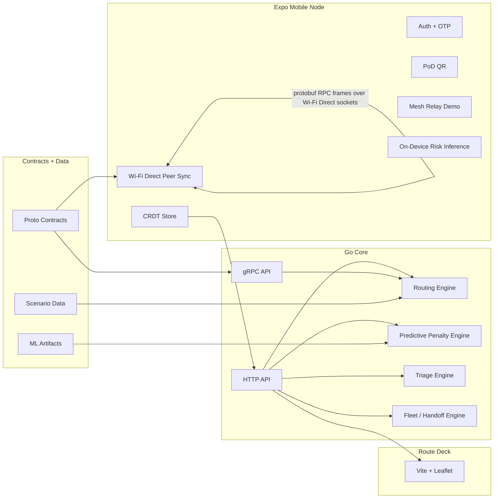

  

    
HackFusion 2026

    <h1 class="text-6xl font-black leading-tight !mb-6">Huntrix Delta</h1>
    

      Offline-first disaster logistics for flood response when internet, roads, and trust channels fail at the same time.
    

    

      Expo Mobile
      Go Core
      CRDT + Sync
      ML Routing
    

  

  

    

      
Challenge

      
Digital Delta

      

        Resilient logistics and mesh triage for disaster response in flood conditions across Bangladesh.
      

    

  

<!--
Open with the problem and the one-line value proposition. Keep this under 20 seconds.
-->

---
layout: two-cols
---

# Problem

When flood conditions hit:

<v-clicks>

- cellular connectivity becomes unreliable or unavailable
- roads and waterways change faster than static plans
- deliveries still need identity, trust, and handoff proof
- central-server assumptions slow down field response

</v-clicks>

::right::

  
Mission

  

    Coordinate relief across volunteers, boats, drones, and field camps even when the internet is unavailable for most of the operation timeline.
  

<!--
Emphasize that this is not only a routing problem. It is sync, trust, and prioritization under partition.
-->

---
layout: section
---

# Solution

Huntrix Delta keeps field operations moving with local-first logic, delayed convergence, cryptographic handoff proof, and live rerouting under disaster conditions.

<!--
Short bridge slide. Move fast to architecture.
-->

---

# Architecture

  
Mobile: offline auth, CRDT state, PoD, peer sync

  
Go: routing, triage, orchestration, predictive penalties

  
Proto: shared contract boundary across app and services

<!--
Call out the contract-first architecture and the practical transport honesty.
-->

---
layout: two-cols-header
---

# Key Engineering Decisions

::left::

<v-clicks>

- **AP over strict consistency**
  field devices continue operating while partitioned, then converge later
- **CRDT + vector clocks**
  inventory state merges deterministically and conflicts stay visible
- **Ed25519 + SHA-256 + AES-256-GCM**
  identity, delivery proof, and encrypted mesh payloads

</v-clicks>

::right::

<v-clicks>

- **Protobuf-first contracts**
  shared schema boundary across mobile, backend, and sync packets
- **Wi-Fi Direct peer transport**
  real phone-to-phone transport carrying protobuf RPC frames
- **Simple interpretable ML**
  logistic regression for explainable route-risk scoring

</v-clicks>

<!--
Say clearly: strongest caveat is transport semantics, not schema semantics.
-->

---

# Live Demo Path

  

    
Offline Path

    <ol class="leading-8 text-slate-100">
      <li>1. Offline auth and audit integrity</li>
      <li>2. CRDT merge and conflict resolution</li>
      <li>3. Proof-of-delivery QR handshake</li>
      <li>4. Two-device peer sync</li>
    </ol>
  

  

    
Decision Layer

    <ol class="leading-8 text-slate-100">
      <li>5. Route failure injection</li>
      <li>6. Triage preemption</li>
      <li>7. Predictive reroute</li>
      <li>8. Hybrid fleet handoff</li>
    </ol>
  

  Built to fit the judge slot in 10 minutes.

<!--
This slide anchors the narrative before the actual demo.
-->

---

# Module Coverage

  
<strong>M1</strong> Offline OTP, keys, RBAC, audit log

  
<strong>M2</strong> CRDT, vector clocks, peer sync proof

  
<strong>M3</strong> Store-and-forward relay + encrypted mesh proof

  
<strong>M4</strong> Multimodal routing + live route deck

  
<strong>M5</strong> Signed QR PoD + replay rejection

  
<strong>M6</strong> SLA breach prediction + preemption

  
<strong>M7</strong> Route decay ML + reroute penalties

  
<strong>M8</strong> Drone-required zones + rendezvous logic

  Strategy: prioritize <strong>6–7 strong modules</strong> with end-to-end proof over shallow coverage everywhere.

<!--
Keep it honest. Say M2.4 is strongest with two-device proof but still has a transport caveat.
-->

---
layout: two-cols
---

# ML And Intelligence

<v-clicks>

- model: logistic regression
- features:
  - cumulative rainfall
  - rainfall rate change
  - elevation
  - soil saturation proxy
- train/test split: `80 / 20`
- threshold: `0.7`
- current metrics:
  - precision `1.0`
  - recall `0.8333`
  - F1 `0.9091`

</v-clicks>

::right::

  
Integration

  <ul class="leading-8 text-slate-200">
    <li>risk scores feed routing penalties</li>
    <li>dashboard overlays show confidence</li>
    <li>mobile app runs on-device inference from exported coefficients</li>
  </ul>

<!--
One honest sentence: this is a hackathon-quality synthetic dataset, but the model is integrated and visible.
-->

---

# Demo Result Summary

  

    
Peer Sync

    
Two-device Wi-Fi Direct transport carrying protobuf SyncService RPC frames.

  

  

    
Route Response

    
Failure injection triggers recomputation and updated active routes.

  

  

    
Proof of Delivery

    
Signed challenge, countersigned receipt, replay rejection, receipt chain.

  

  

    
Priority Logic

    
Triage engine preempts lower-priority cargo when critical SLA breach risk appears.

  

<!--
This is your “what the judges just saw” slide.
-->

---
layout: end
---

# Roadmap

  

    
Near Term

    <ul class="leading-8 text-slate-200">
      <li>full on-device HTTP/2 gRPC transport</li>
      <li>more robust two-phone sync hardening</li>
      <li>final exported architecture and model-card PDFs</li>
    </ul>
  

  

    
Future

    <ul class="leading-8 text-slate-200">
      <li>real field datasets and calibration</li>
      <li>hardware-backed storage hardening</li>
      <li>larger mesh stress testing and delivery drills</li>
    </ul>
  

  Huntrix Delta is built to keep relief operations moving when connectivity is the first thing to fail.

<!--
Close with confidence but keep the transport caveat honest if judges ask.
-->
